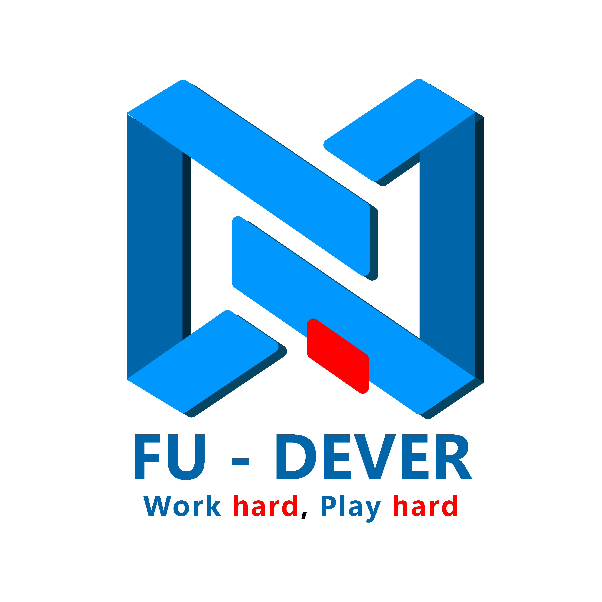

<div align="center">

<picture>
  <source media="(prefers-color-scheme: dark)" srcset="docs/assets/FU_DEVER_Logo_White_Layers_Red_Accent.png">
  <source media="(prefers-color-scheme: light)" srcset="docs/assets/logodever-01.png">
  
</picture>

# ⚔️ DEVER Arena

**Nền tảng thi đấu thuật toán của CLB Lập trình FU-DEVER — Trường Đại học FPT Đà Nẵng**

[](https://github.com/fudever-club/dever-arena/actions/workflows/ci.yml)
[](tests/)
[](LICENSE)
[](https://web-elegant-horse.spcf.app)

</div>

## Giới thiệu

Nền tảng tổ chức kỳ thi thuật toán nội bộ theo chuẩn quốc tế: vòng đời 3 phase `REGISTRATION → CODING → FINISHED`, chấm bài thật trên server ngay khi nộp, bảng điểm ICPC với freeze 30 phút cuối giờ. Tài khoản do admin cấp, không đăng ký công khai.

## Tính năng

- **Thi đấu ICPC** (mặc định): xếp theo solved + penalty (20′/WA), scoreboard freeze cuối giờ; tùy chọn thể thức Codeforces (điểm giảm theo phút) và IOI.
- **Judge thật đa ngôn ngữ:** Python, C++, Java, JavaScript — chấm full-suite trả verdict cuối (AC/WA/TLE/MLE/RTE/CE), feedback per-test mở sau khi kết thúc, rejudge, upsolving + editorial.
- **Soạn đề Polygon:** quản lý bài theo kỳ thi, testcase, validator + stress test (model vs brute), duyệt bài DRAFT → IN_TESTING → APPROVED.
- **Multi-organizer:** phân quyền ORGANIZER quản kỳ thi mình phụ trách; admin toàn quyền.
- **Profile & so sánh:** Elo history, heatmap, thống kê verdict/tag/ngôn ngữ, so sánh 2 thí sinh, thi ảo (virtual contest) và trang tổng kết in PDF.
- **Anti-cheat:** đối soát tương đồng mã nguồn AST + winnowing sau contest; Zero-AI client theo ADR-003.

## Kiến trúc

| Lớp | Công nghệ |
|---|---|
| Web | React 19 + Vite 8 + Tailwind CSS v4, Monaco Editor, KaTeX |
| API | Node thuần (REST + SSE + JWT), không framework |
| Judge | Fork pool worker, toolchain Python3/JDK 17/g++ |
| Dữ liệu | PostgreSQL schema v2 (10 bảng typed + extra JSONB), object store S3 cho source code |
| Hạ tầng | Docker (compose) hoặc [Specific Cloud](https://dashboard.specific.dev) — deploy tự động khi push `main` qua GitHub integration |

```
app.html (SPA) ──► API Node (REST+SSE) ──► Judge queue (fork pool)
                        │                        │
                        ▼                        ▼
                 PostgreSQL (10 bảng)      python3 / javac / g++
                        │
                        ▼
              S3 object store (source_code, backup JSON hằng ngày)
```

Vòng đời chi tiết: [ADR-005](docs/decisions/ADR-005-international-contest-lifecycle.md) · Schema CSDL: [`docs/DATABASE_SCHEMA.md`](docs/DATABASE_SCHEMA.md)

## Chạy cục bộ

```bash
git clone https://github.com/fudever-club/dever-arena.git
cd dever-arena
npm install

npm run server   # API + judge, port 8787, DB JSON tự seed
npm run dev      # Web SPA, http://localhost:5173
```

Tài khoản seed (chỉ môi trường local): `dever_hero/hero123`, `dever_admin/admin123`.

### Production

```bash
# Docker Compose
cp .env.example .env   # điền DEVER_JWT_SECRET
docker compose up --build -d

# hoặc Specific Cloud (đang chạy production)
specific check && specific deploy
```

Chi tiết: [`docs/DEPLOYMENT_GUIDE.md`](docs/DEPLOYMENT_GUIDE.md)

## Kiểm thử

```bash
npm test            # 210 unit + integration (24 suites)
npm run test:browser # 7 E2E Playwright (SPA + a11y axe, cần Chromium)
npm run lint:js     # ESLint
npm run lint        # detect.mjs — ràng buộc kiến trúc
npm run test:load   # 20 job đồng loạt
```

CI chạy đủ 4 bước trên mọi push/PR (GitHub Actions); push `main` tự deploy production.

## Quyết định kiến trúc (ADR)

| ADR | Nội dung |
|---|---|
| [ADR-001](docs/decisions/ADR-001-three-page-architecture.md) | Tách layout Guest/User/Admin |
| [ADR-002](docs/decisions/ADR-002-isolate-sandbox-execution.md) | Sandbox thực thi + fail-fast |
| [ADR-003](docs/decisions/ADR-003-pure-core-engine-and-zero-ai.md) | Core engine thuần + Zero-AI client |
| [ADR-004](docs/decisions/ADR-004-ast-winnowing-anti-cheat.md) | AST winnowing anti-cheat |
| [ADR-005](docs/decisions/ADR-005-international-contest-lifecycle.md) | Vòng đời thi đấu 3 phase chuẩn quốc tế |

## Cấu trúc

```
├── app.html            # SPA entry
├── src/                # React app (pages, components, core, engine)
├── server/             # API + judge + Postgres adapter + S3 (zero-dep)
├── scripts/            # backup/restore/migrate/load-test
├── tests/              # 26 test suites (unit, integration, E2E, a11y)
├── docs/               # Đặc tả + ADR + hướng dẫn vận hành
└── specific.hcl        # Hạ tầng Specific Cloud (api/web/postgres/storage/cron)
```

## Liên hệ

**CLB Lập trình FU-DEVER** — Trường Đại học FPT Đà Nẵng
[Facebook](https://www.facebook.com/FPTUDever) · [Website](https://fu-dever-landingpage-v2.vercel.app/) · [club.dever@gmail.com](mailto:club.dever@gmail.com)

Phát hành theo giấy phép **MIT**.
