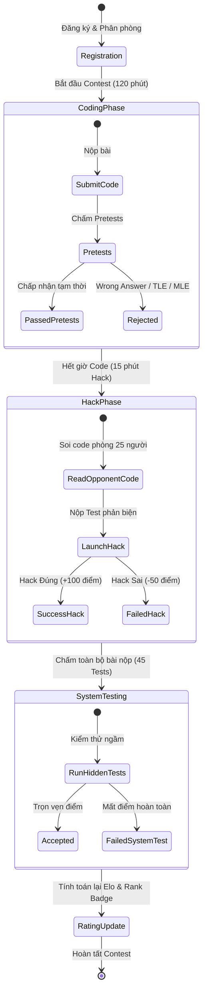

<div align="center">

# ⚔️ DEVER Arena (DEVER-Forces)

**Nền tảng thi đấu lập trình giải thuật trực tuyến chuẩn Codeforces & ICPC của CLB FU-DEVER — Đại học FPT Đà Nẵng**

[](https://opensource.org/licenses/MIT)
[](https://nodejs.org/)
[](https://react.dev/)
[](https://vitejs.dev/)
[](https://tailwindcss.com/)
[-success?logo=checkmarx&logoColor=white)](tests/)
[](PRODUCT.md)

[Tính Năng Nổi Bật](#-tính-năng-nổi-bật) • [Kiến Trúc Hệ Thống](#-kiến-trúc-hệ-thống) • [Vòng Đời Contest](#-vòng-đời-thi-đấu-chuẩn-codeforces) • [Cài Đặt & Khởi Chạy](#-cài-đặt--khởi-chạy) • [Kiểm Thử](#-kiểm-thử--chất-lượng-mã-nguồn) • [Sổ Bộ ADR](#-sổ-bộ-quyết-định-kiến-trúc-adr)

---

</div>

## 📌 Giới Thiệu Tổng Quan

**DEVER Arena** (mật danh: *DEVER-Forces*) là nền tảng thi đấu thuật toán và luyện tập Competitive Programming chuyên sâu được nghiên cứu và phát triển bởi **CLB Lập trình FU-DEVER (Trường Đại học FPT Đà Nẵng)**.

Hệ thống được thiết kế nhằm mục đích:
1. **Mô phỏng 100% chân thực vòng đời kỳ thi Codeforces**: Phân phòng (Hack Room), chấm sơ bộ (Pretests), vòng phản biện đối thủ (Instant Hacking Phase) và kiểm thử hệ thống ngầm (System Testing).
2. **Liêm chính học thuật tuyệt đối**: Trang bị engine AST Winnowing phát hiện đạo văn mã nguồn tự động, triệt tiêu việc ngụy trang bằng cách đổi tên biến hay xóa chú thích, đồng thời cam kết **Zero-AI Client** (loại bỏ hoàn toàn AI sinh code trong các round Rated).
3. **Sư phạm qua phản biện**: Tính năng Hack Room 25 người tạo cơ hội để sinh viên đọc hiểu mã nguồn của bạn học, phát hiện các trường hợp biên (edge cases), tràn số (`integer overflow`) hay độ phức tạp thuật toán vượt ngưỡng (`TLE`).
4. **Vinh danh tập thể (Clan Wars)**: Hệ thống xếp hạng bang hội House of Buggy (K18, K19, K20, K21...) theo thuật toán Harmonic Mean Top-5.

---

## ⚡ Tính Năng Nổi Bật

### 1. 🎯 Chế Độ Thi Đấu Chuẩn Codeforces & ICPC
* **Dynamic Time-Decay Scoring**: Điểm bài nộp giảm dần theo thời gian làm bài theo công thức chính thống Codeforces:
  $$\text{Score} = \max\left(0.3 \cdot P_{\max},\; P_{\max} - \frac{P_{\max} \cdot t}{250} - 50 \cdot W\right)$$
  *(với $P_{\max}$ là điểm tối đa, $t$ là số phút thi trôi qua, $W$ là số lần nộp Wrong Answer).*
* **Phòng Thách Đấu (Hack Room 25 Thí Sinh)**: Xem mã nguồn đối thủ trong cùng phòng thi, nộp test phản biện (Generator/Custom Test). Thách đấu thành công nhận **+100 điểm**, thách đấu sai bị phạt **-50 điểm**.
* **System Testing Tự Động**: Chạy toàn bộ 45+ bộ test ngầm bí mật để xác định kết quả chung cuộc, lật ngược tình thế trước khi cập nhật điểm xếp hạng Elo.
* **ICPC Scoreboard Freeze & Dramatic Reveal**: Đóng băng bảng điểm ở 60 phút cuối trận và công cụ mô phỏng giải băng kịch tính từng bài thi.

### 2. 🛡️ AST Winnowing Anti-Cheat Sentinel
* **AST Tokenizer**: Phân tích cú pháp trừu tượng, loại bỏ bình luận, khoảng trắng, chuẩn hóa tên biến/hàm về token định danh đồng nhất.
* **Winnowing Fingerprinting Algorithm**: Tạo dấu vân tay mã nguồn k-gram/3-gram với chi phí bộ nhớ tối ưu.
* **Jaccard Distance Matrix**: Đối soát chéo toàn bộ lời giải trong cùng contest; tự động gắn cờ cảnh báo giám khảo khi độ tương đồng vượt ngưỡng 85%.
* **Zero-AI Client Contract**: Loại bỏ các extension/plugin AI can thiệp để bảo đảm sân chơi công bằng cho các đội tuyển ICPC/Olympic.

### 3. 🧪 DEVER Polygon Problemsetter Studio
* **Testlib Input Validator**: Kiểm tra định dạng testcase cực kỳ nghiêm ngặt (kiểm tra newline cuối file, cấm trailing whitespace, kiểm soát biên $N$ và từng phần tử).
* **Custom Checker Suite**: Hỗ trợ 3 cơ chế chấm:
  - *Token Matcher*: So khớp từ vựng bỏ qua khoảng trắng/xuống dòng.
  - *Float Tolerance*: So khớp số thực với sai số $\epsilon = 10^{-6}$ hoặc $10^{-9}$.
  - *Multiple Solutions Verifier*: Trình chấm tùy biến cho bài toán có nhiều nghiệm hợp lệ.

### 4. 🕹️ Virtual Contest Simulator (Ghost Replay)
* Tái hiện lại bất kỳ contest đã diễn ra trong quá khứ.
* Hệ thống sinh dữ liệu ảo (Ghost Participants) với timeline nộp bài và tỉ lệ AC/WA theo từng phút thực tế.

---

## 🏛️ Kiến Trúc Hệ Thống (Dual-Stack Architecture)

DEVER Arena được thiết kế theo kiến trúc kép để đảm bảo tính linh hoạt tối đa:

```
DEVER Arena
├── 1. Zero-Build Baseline (Static Web)
│   ├── index.html       # Landing page giới thiệu & điều lệ
│   ├── arena.html       # Giao diện thi đấu thuần Vanilla JS
│   ├── admin.html       # Bảng điều khiển dành cho Giám khảo / Problemsetter
│   └── css/ & js/       # Vanilla CSS3 Cyber Dark + ES Modules
│
└── 2. Enterprise SPA (React 19 + Vite)
    ├── app.html         # Single Page Application Shell
    ├── src/             # Toàn bộ mã nguồn React 19 & Tailwind CSS v4
    │   ├── components/  # Monaco Workspace, Resizable Splitters, KaTeX Math
    │   ├── core/        # Pure Engine: Scoring, Rating, State Machine, Freeze
    │   ├── engine/      # AST Winnowing, Isolate Sandbox, Testlib Validator
    │   └── pages/       # Arena, Problemset, Standings, Admin, Virtual
    └── tests/           # 25 test suites native (100% PASS)
```

1. **Lightweight Zero-Build Baseline**: Chạy độc lập trên Nginx hoặc bất kỳ static web host nào, không yêu cầu Node.js runtime khi triển khai bản nhẹ.
2. **Modern Enterprise SPA**: Xây dựng trên nền **React 19**, **Vite 8**, **Tailwind CSS v4**, tích hợp **Monaco Editor Pro** (bộ gõ chuẩn VS Code), hỗ trợ **Resizable Splitters (20-80%)**, **Zen Mode**, **KaTeX Math Typography** và đồng bộ đa tab qua **BroadcastChannel**.

---

## 🔄 Vòng Đời Thi Đấu Chuẩn Codeforces



---

## 📜 Sổ Bộ Quyết Định Kiến Trúc (ADR)

Mọi quyết định thiết kế quan trọng của hệ thống đều được lưu trữ minh bạch tại [`docs/decisions/`](docs/decisions/):

| Mã số | Tiêu đề quyết định | Trạng thái | Tóm tắt tác động kỹ thuật |
|---|---|---|---|
| [**ADR-001**](docs/decisions/ADR-001-three-page-architecture.md) | Kiến trúc 3 trang HTML độc lập | **Accepted** | Tối ưu SEO (1 H1/trang), FCP < 360ms, cô lập ranh giới an ninh Thí sinh và Giám khảo. |
| [**ADR-002**](docs/decisions/ADR-002-isolate-sandbox-execution.md) | Cơ chế Isolate Sandbox & Dừng sớm | **Accepted** | Chặn 18 API trình duyệt độc hại, TLE 1.0s, MLE 256MB, Fail-Fast khi WA test đầu. |
| [**ADR-003**](docs/decisions/ADR-003-pure-core-engine-and-zero-ai.md) | Core Engine hàm thuần & Zero-AI Client | **Accepted** | Tách biệt 100% logic nghiệp vụ khỏi DOM, 98/98 test pass, giữ vững liêm chính thi đấu. |
| [**ADR-004**](docs/decisions/ADR-004-ast-winnowing-anti-cheat.md) | AST Tokenizer & Thuật toán Winnowing 3-Gram | **Accepted** | Khử đổi tên biến và comment rác, tính khoảng cách Jaccard phát hiện gian lận tự động. |

---

## 🚀 Cài Đặt & Khởi Chạy

### Yêu Cầu Tiên Quyết
* **Node.js**: Phiên bản `>= 18.0.0`
* **npm**: Phiên bản `>= 9.0.0`

### 1. Cài đặt các gói phụ thuộc
```bash
# Clone kho mã nguồn
git clone https://github.com/fudever-club/dever-arena.git
cd dever-arena

# Cài đặt thư viện
npm install
```

### 2. Chạy môi trường phát triển (Development)
```bash
# Khởi chạy Vite Dev Server (React 19 SPA)
npm run dev
# Mở trình duyệt tại: http://localhost:5173/app.html
```

Nếu muốn chạy giao diện **Zero-Build Static Web**:
```bash
npm run serve
# Mở trình duyệt tại: http://localhost:3000/index.html
```

### 3. Đóng gói triển khai (Production Build)
```bash
npm run build
```
Bản build tối ưu hóa sẽ được tạo tại thư mục `dist/`.

---

## 🧪 Kiểm Thử & Chất Lượng Mã Nguồn

Dự án áp dụng quy chuẩn kiểm thử nghiêm ngặt với bộ Test Runner tích hợp sẵn trong Node.js (Zero external test runner bloatware):

```bash
# Chạy toàn bộ 25 Test Suites (98 tests)
npm run test

# Chạy chế độ theo dõi (Watch mode)
npm run test:watch

# Chạy kiểm thử End-to-End với Playwright
npm run test:e2e

# Quét kiểm tra chất lượng mã nguồn (Linter)
npm run lint
```

### Kết quả kiểm thử tự động mẫu:
```
✔ DEVER-Forces Rating Engine Tests (1.89ms)
✔ DEVER-Forces Scoring Engine Tests (1.75ms)
✔ DEVER Polygon Testlib Input Validator Tests (2.18ms)
✔ DEVER Polygon Custom Checker Engine Tests (1.48ms)
✔ DEVER Virtual Contest Simulator Engine Tests (2.65ms)
✔ DEVER Judge Worker Queue & Priority Engine Tests (2.93ms)
✔ DEVER Isolate Sandbox Runner Tests (0.59ms)
...
ℹ tests 98
ℹ suites 25
ℹ pass 98
ℹ fail 0
```

---

## 📂 Cấu Trúc Thư Mục Dự Án

```
dever-arena/
├── .agents/                    # Bộ Agent Skills dành cho phát triển tự động
│   └── skills/
│       ├── dever-anti-cheat-sentinel/
│       ├── dever-arena-orchestrator/
│       └── polygon-problemsetter/
├── docs/                       # Tài liệu thiết kế & đặc tả hệ thống
│   ├── decisions/              # Bộ lưu trữ ADR (ADR-001 -> ADR-004)
│   ├── ANTI_CHEAT_POLICY.md    # Quy chuẩn chống gian lận & liêm chính
│   ├── CONTEST_RULEBOOK.md     # Luật thi đấu, thang điểm & hack room
│   ├── DATABASE_SCHEMA.md      # Thiết kế cơ sở dữ liệu IndexedDB & SQL
│   ├── DESIGN_SYSTEM.md        # Bảng màu, typography & quy tắc UI
│   └── JUDGE_ARCHITECTURE.md   # Thiết kế hệ thống máy chấm Isolate Sandbox
├── db/
│   └── schema.sql              # Cấu trúc bảng SQL chuẩn cho production
├── problems/                   # Thư viện đề mẫu chuẩn Polygon
│   ├── prob_A_cyber_sum/
│   └── prob_B_modulo_matrix/
├── src/                        # Mã nguồn chính của ứng dụng
│   ├── components/             # React components (Workspace, Splitters, Math)
│   ├── core/                   # Scoring, rating, contest state machine
│   ├── engine/                 # AST diff, runner, sound, testlib validator
│   ├── pages/                  # Các trang SPA (Arena, Problemset, Admin, Standings)
│   └── index.css               # Thiết lập Tailwind v4 & Cyber Dark theme
├── tests/                      # Bộ 25 test suites kiểm thử tự động
├── admin.html                  # Giao diện quản trị viên & problemsetter
├── arena.html                  # Giao diện thi đấu Zero-Build
├── app.html                    # Giao diện ứng dụng SPA
├── index.html                  # Trang chủ giới thiệu
├── package.json
└── README.md
```

---

## 👥 Ban Phát Triển & Bản Quyền

Dự án được xây dựng và duy trì bởi **CLB Lập Trình FU-DEVER** — Trường Đại học FPT Đà Nẵng.

* **Email liên hệ**: [club.dever@gmail.com](mailto:club.dever@gmail.com)
* **Fanpage CLB**: [FU-DEVER Club](https://facebook.com/fudever)
* **GitHub Tổ Chức**: [@fudever-club](https://github.com/fudever-club)

Mã nguồn được phát hành theo giấy phép **MIT License**. Mọi đóng góp (Pull Requests, Issue Reports) từ cộng đồng sinh viên FPT và lập trình viên đều được chào đón nồng nhiệt!
