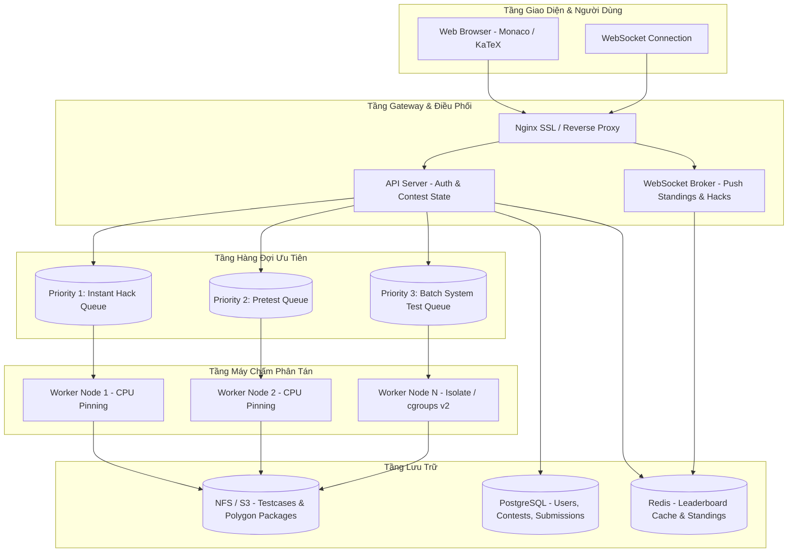

# CẨM NANG VẬN HÀNH & KIẾN TRÚC HỆ THỐNG DÀNH CHO AI AGENT & KỸ SƯ
> **Tài liệu hướng dẫn chuyên sâu (Agent Playbook): Cách các nền tảng giải thuật hàng đầu thế giới (Codeforces, AtCoder, DMOJ, VNOI) hoạt động ở tầng nhân (Under the hood) và cách DEVER Arena được thiết kế để chuẩn hóa.**

---

## 1. TỔNG QUAN KIẾN TRÚC VẬN HÀNH CÁC NỀN TẢNG THI ĐẤU LỚN



---

## 2. NHỮNG BÍ QUYẾT CỐT LÕI CỦA CÁC NỀN TẢNG LỚN (INDUSTRY INTERNALS)

### 2.1. Codeforces: Hệ sinh thái Polygon, Pretest, Hack & System Test
* **Polygon Ecosystem:** Codeforces không soạn đề trên web thi đấu. Toàn bộ đề thi được sinh qua hệ thống **Polygon** bằng thư viện `testlib.h`.
  * `validator.cpp`: Đảm bảo mọi input (kể cả input thí sinh tự gõ để hack) không vi phạm $N, K, A_i$.
  * `generator.cpp`: Sinh các testcase ngẫu nhiên bằng bộ sinh số giả ngẫu nhiên xác định (`rnd.next()`) để kết quả test trên mọi máy tính là đồng nhất 100%.
  * `checker.cpp`: Dùng khi bài toán có nhiều nghiệm đúng (Special Judge).
* **Pretests vs. System Tests:**
  * Để server không bị quá tải khi 30,000 thí sinh submit cùng lúc, Codeforces chỉ chấm **5–15 testcase nhẹ (Pretests)** trong giờ thi.
  * Hết giờ thi, **System Testing** chạy hàng loạt trên toàn bộ 50–100 testcase ẩn (kèm các testcase hack thành công).
* **Hack / Challenge Phase:** Thí sinh khóa bài nộp của mình ➔ được quyền mở code đối thủ trong cùng Room ➔ tìm bug (như tràn số `int`, TLE do hàm băm `unordered_map`) ➔ nộp input bẫy để nhận $+100$ điểm.

### 2.2. AtCoder: Kiến trúc Chống Nghẽn & Chấm Mã Nguồn Siêu Nhanh
* **Hockey-Stick Traffic Surge:** AtCoder nổi tiếng với lượng nộp bài tăng vọt 5x-10x vào 5 phút cuối contest.
* **Giải pháp AtCoder:**
  * **CPU Pinning:** Mỗi worker chấm được cố định trên 1 core CPU vật lý riêng biệt để đo thời gian CPU chính xác đến microsecond, không bị ảnh hưởng bởi các tiến trình khác.
  * **Idempotency Control:** Cơ chế khóa chống trùng lặp bài nộp để đảm bảo một lượt submit chỉ được chấm đúng một lần duy nhất.
  * **Zero-bloat UI:** Web AtCoder tải trang dưới 50ms, không chứa script nặng nề.

### 2.3. DMOJ & VNOI: Cơ Chế Cách Ly An Toàn (Sandboxing)
* **`ptrace(2)` vs `isolate`:**
  * DMOJ nguyên bản sử dụng `ptrace(2)` để chặn và kiểm duyệt từng system call của tiến trình thí sinh mà không cần quyền root.
  * Các hệ thống hiện đại (như VNOI, Codeforces) chuyển dần sang **Isolate** (Linux namespaces + cgroups v2):
    * Giới hạn RAM: Nhân Linux lập tức gửi `SIGKILL` khi vượt quota.
    * Chặn mạng hoàn toàn: Không có socket mạng, không thể kết nối ra ngoài.
    * Chặn Fork bomb: Giới hạn tối đa 64 pids.

---

## 3. HƯỚNG DẪN DÀNH CHO AI AGENT KHI PHÁT TRIỂN & MỞ RỘNG DEVER ARENA

Khi một AI Agent tiếp nhận nhiệm vụ mở rộng hoặc sửa đổi mã nguồn của DEVER Arena, Agent **bắt buộc phải tuân thủ các bất biến (Invariants)** sau:

### 3.1. Bất biến về Thuật toán Tính điểm (`src/core/scoring.js`)
* **Quy tắc Codeforces:**
  1. Điểm suy giảm theo thời gian: $P_{decay} = \max(0.3 \times P_{\max}, P_{\max} - \lfloor \frac{P_{\max} \times t}{250} \rfloor - 50 \times W)$.
  2. Tuyệt đối không được để điểm bài giải đúng giảm xuống dưới mức sàn $30\% \times P_{\max}$.
  3. Hack đúng luôn là $+100$ điểm, hack sai luôn bị trừ $-50$ điểm.
* **Quy tắc ICPC:**
  1. Xếp hạng ưu tiên số bài AC.
  2. Penalty = $\sum (\text{Phút AC} + 20 \times W)$.
  3. Bài nộp sai nhiều lần nhưng **chưa AC thì KHÔNG được cộng penalty**.

### 3.2. Bất biến về Vòng đời Thi đấu (`src/core/contestStateMachine.js`)
* Chỉ cho phép nộp code trong `CODING` phase.
* Chỉ cho phép xem code đối thủ và thực hiện Hack trong `HACK_PHASE` và chỉ giữa những người **cùng một Room**.
* Nghiêm cấm nhảy cóc trạng thái: `REGISTRATION` ➔ `CODING` ➔ `HACK_PHASE` ➔ `SYSTEM_TESTING` ➔ `FINISHED`.

### 3.3. Bất biến về Chống Gian Lận (`src/engine/astDiff.js`)
* Thuật toán so khớp mã nguồn dựa trên phân tích Token AST.
* Khi thêm từ khóa mới, phải cập nhật `KEYWORDS` set trong `astDiff.js` để tránh việc đổi tên biến lừa được bộ so khớp.
* Ngưỡng phát hiện vi phạm:
  * $< 60\%$: Hợp lệ (CLEAR).
  * $60\% - 80\%$: Nghi vấn xem xét (SUSPICIOUS).
  * $\ge 80\%$: Gian lận xác thực (PLAGIARISM_CONFIRMED).

### 3.4. Bất biến về Kiểm thử (Zero Regression Bar)
* Mọi chỉnh sửa mã nguồn cốt lõi bắt buộc phải chạy lệnh kiểm thử:
  ```powershell
  node --test tests/*.test.js
  ```
* Toàn bộ 21+ unit tests phải PASS 100% trước khi bàn giao cho người dùng.

---

*Tài liệu này là kim chỉ nam cho tất cả các Agent và Kỹ sư phát triển DEVER Arena.*
