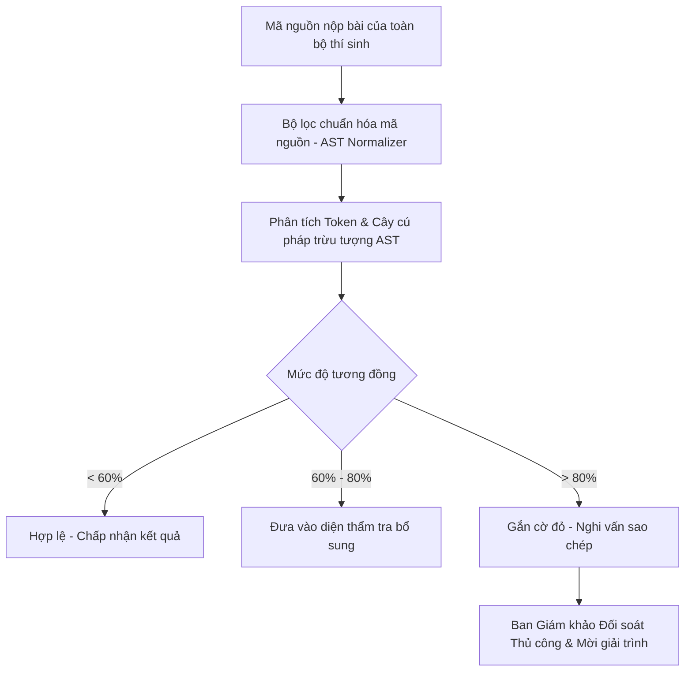

# CHÍNH SÁCH LIÊM CHÍNH & CHỐNG GIAN LẬN DEVER-FORCES
> **Nguyên tắc vàng: Thà 0 điểm vì thiếu kiến thức, còn hơn bị tước quyền vì thiếu liêm chính.**

---

## 1. CÁC HÀNH VI BỊ COI LÀ GIAN LẬN (ACADEMIC MISCONDUCT)

Trong các kỳ thi tính điểm Elo Rating trên DEVER-Forces, các hành vi sau đây bị cấm tuyệt đối:

1. **Sử dụng Trí tuệ Nhân tạo Tạo sinh (Generative AI):**
   * Sử dụng ChatGPT, Claude, GitHub Copilot, Gemini hoặc bất kỳ mô hình ngôn ngữ lớn (LLM) nào để giải đề, sinh mã nguồn, hoặc dịch đề trong thời gian diễn ra kỳ thi.
2. **Hợp tác hoặc Trao đổi Thông tin:**
   * Thảo luận đề bài, chia sẻ giải thuật, gửi mã nguồn hoặc testcase qua Discord, Facebook Messenger, Zalo, Telegram, Google Meet hoặc trực tiếp tại phòng lab.
   * Đăng tải đề bài hoặc hỏi lời giải trên các diễn đàn trực tuyến (StackOverflow, Reddit, VNOI Discord,...).
3. **Tài khoản Giả mạo / Đa tài khoản (Smurfing / Multi-accounting):**
   * Một thí sinh sử dụng nhiều tài khoản trong cùng một contest.
   * Thí sinh có trình độ cao (Master, Grandmaster) dùng tài khoản phụ (clone) mức rank thấp (Newbie) để tham gia các bảng Div. 3/4 nhằm cày cúp hoặc phá hoại bảng xếp hạng.
4. **Tấn công Kỹ thuật Hệ thống Chấm:**
   * Cố tình nộp mã độc nhằm làm sập máy chấm (Fork Bomb, chiếm dụng toàn bộ ổ đĩa, truy cập trái phép thư mục chứa testcases bí mật).
   * Mọi nỗ lực bypass sandbox của hệ thống đều bị xử lý kỷ luật mức cao nhất.

---

## 2. QUY TRÌNH HẬU KIỂM TỰ ĐỘNG (PLAGIARISM DETECTION SYSTEM)

Sau khi contest kết thúc và trước khi chốt Rating chính thức, hệ thống thực hiện quy trình kiểm tra tự động 3 bước:

### Chi tiết kỹ thuật của hệ thống so khớp mã nguồn:
* **AST Normalization (Khử ngụy trang):**
  * Đổi tên biến (Rename variables: ví dụ `x`, `y` thành `temp1`, `temp2`).
  * Thay đổi cấu trúc vòng lặp (chuyển `for` thành `while` hoặc đệ quy tương đương).
  * Chèn các comment rác hoặc đoạn code chết không thực thi (`int dummy = 0;`).
  * Tất cả các thủ thuật ngụy trang trên đều bị triệt tiêu khi phân tích qua cây cú pháp AST (Abstract Syntax Tree) và thuật toán Winnowing fingerprinting.

---

## 3. CHÍNH SÁCH XỬ PHẠT (DISCIPLINARY ACTIONS)

Mọi vi phạm được lưu vào hồ sơ thành viên của CLB FU-DEVER và áp dụng khung kỷ luật:

| Mức độ vi phạm | Lần 1 | Lần 2 |
| :--- | :--- | :--- |
| **Chia sẻ code / Chép code của nhau** | • Hủy kết quả contest (Unrated). • Trừ **-200 điểm Elo** danh dự. • Cấm thi trong 3 contest tiếp theo. | • **Cấm thi vĩnh viễn** trên hệ thống. • Thu hồi toàn bộ huy hiệu danh dự. • Khai trừ khỏi CLB FU-DEVER. |
| **Sử dụng AI trong Rated Contest** | • Hủy kết quả contest. • Phạt công khai trên kênh Discord/Group CLB. • Ghi nhận vào hồ sơ rèn luyện CLB. | • Cấm thi vĩnh viễn trên DEVER-Forces. • Tước quyền xét duyệt thực tập/học bổng nội bộ. |
| **Tấn công phá hoại hệ thống judge** | • Khóa tài khoản vĩnh viễn. • Báo cáo vi phạm an toàn thông tin lên Ban Đào Tạo FPTU. | — |

---

## 4. QUY TRÌNH KHIẾU NẠI & GIẢI TRÌNH (APPEAL PROCESS)
1. Thí sinh bị gắn cờ đỏ có thời hạn **48 giờ** kể từ khi công bố kết quả sơ bộ để gửi đơn giải trình.
2. Thí sinh sẽ tham gia một buổi **Phỏng vấn Kỹ thuật Trực tiếp (Code Defense)** trước Hội đồng Chuyên môn CLB:
   * Thí sinh phải giải thích lại tư duy thuật toán, ý nghĩa từng hàm và tự tay code lại lời giải tương tự trong 15 phút.
   * Nếu chứng minh được quyền tác giả, kết quả sẽ được khôi phục đầy đủ.

> Log hack và submission được lưu tại IndexedDB analytics và PostgreSQL hack_events (2026-09-07).
