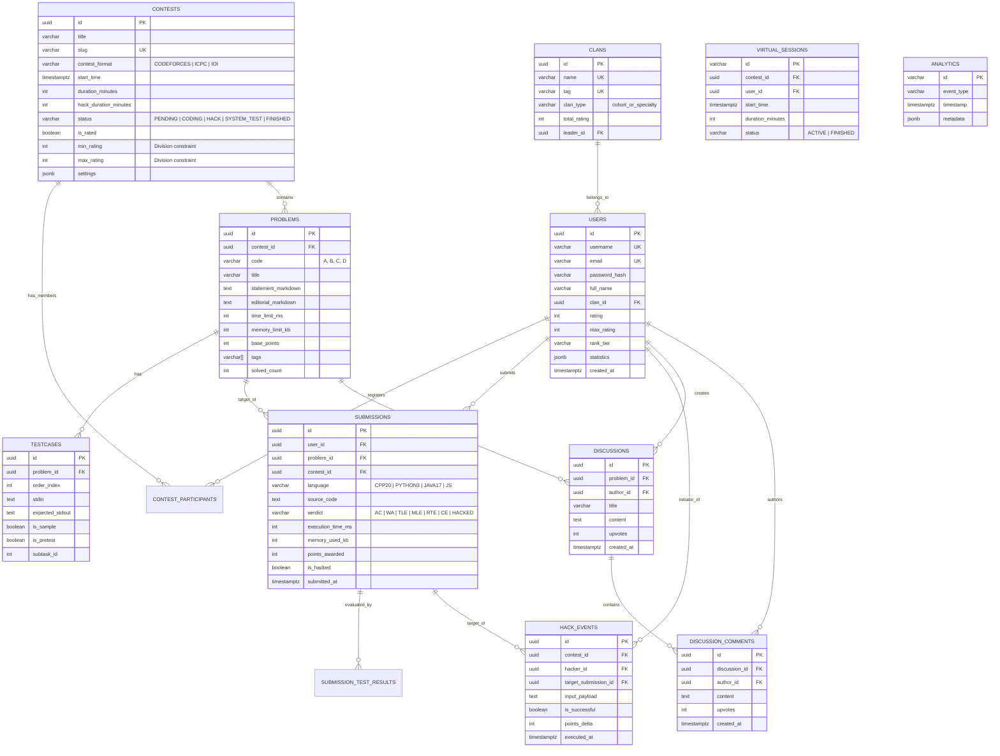

# THIẾT KẾ CƠ SỞ DỮ LIỆU CHUẨN DOANH NGHIỆP (DATABASE ARCHITECTURE & ERD)
> **Hệ quản trị CSDL đề xuất:** PostgreSQL 16+ với các phần mở rộng `uuid-ossp`, `pg_trgm` (Full-Text Search) và `btree_gist`.

---

## 1. SƠ ĐỒ THỰC THỂ MỐI QUAN HỆ (DATABASE ERD)



---

## 2. ĐẶC TẢ CHI TIẾT CÁC BẢNG & RÀNG BUỘC (DATA DICTIONARY)

### 2.1. Bảng `users` (Tài khoản & Hồ sơ Coder)
| Trường dữ liệu | Kiểu dữ liệu | Ràng buộc | Mô tả |
| :--- | :--- | :--- | :--- |
| `id` | `UUID` | `PRIMARY KEY, DEFAULT gen_random_uuid()` | Khóa chính |
| `username` | `VARCHAR(50)` | `UNIQUE, NOT NULL` | Tên tài khoản hiển thị |
| `email` | `VARCHAR(255)` | `UNIQUE, NOT NULL` | Email sinh viên FPT (`@fpt.edu.vn`) |
| `clan_id` | `UUID` | `REFERENCES clans(id) ON DELETE SET NULL` | Khóa học hoặc ban chuyên môn |
| `rating` | `INTEGER` | `DEFAULT 1200, CHECK (rating >= 0)` | Điểm Elo hiện tại |
| `max_rating` | `INTEGER` | `DEFAULT 1200` | Điểm Elo cao nhất từng đạt |
| `rank_tier` | `VARCHAR(30)` | `DEFAULT 'Newbie'` | Tên cấp bậc (Pupil, Specialist,...) |

### 2.2. Bảng `contests` (Quản lý Kỳ thi)
* Hỗ trợ 3 thể thức qua cột `contest_format`:
  * `CODEFORCES`: Điểm giảm theo phút + 15p Hack Phase + System Test.
  * `ICPC`: Tính điểm theo số bài AC + Penalty time (thời gian AC + $20 \times W$).
  * `IOI`: Điểm thành phần theo từng Subtask (0-100).
* Cột `status`: `REGISTRATION` ➔ `CODING` ➔ `HACK_PHASE` ➔ `SYSTEM_TESTING` ➔ `FINISHED`.
* Cột `min_rating` & `max_rating`: Ràng buộc điều kiện tham gia phân hạng (Division Eligibility Gate - Div.1, Div.2, Div.3, Beginner Cup).

### 2.3. Bảng `submissions` & `hack_events`
* `submissions` lưu trữ mã nguồn, kết quả chấm, CPU time, Memory và cờ `is_hacked`.
* `hack_events` lưu lịch sử bẻ khóa: Input độc hại, kết quả hack (`is_successful`), điểm thưởng/phạt.

### 2.4. Bảng `virtual_sessions` (Phiên Thi Đấu Ảo)
| Trường dữ liệu | Kiểu dữ liệu | Ràng buộc | Mô tả |
| :--- | :--- | :--- | :--- |
| `id` | `VARCHAR(100)` | `PRIMARY KEY` | Khóa chính phiên thi ảo (`vs_<uuid>`) |
| `contest_id` | `VARCHAR(100)` | `NOT NULL, REFERENCES contests(id)` | Mã kỳ thi quá khứ được thi lại |
| `user_id` | `VARCHAR(100)` | `NOT NULL, REFERENCES users(id)` | Thí sinh tham gia thi ảo |
| `start_time` | `TIMESTAMPTZ` | `NOT NULL` | Thời điểm bắt đầu phiên thi ảo cá nhân |
| `duration_minutes` | `INTEGER` | `NOT NULL, DEFAULT 120` | Thời lượng làm bài (phút) |
| `status` | `VARCHAR(20)` | `DEFAULT 'ACTIVE'` | Trạng thái: `ACTIVE` hoặc `FINISHED` |

### 2.5. Bảng `analytics` (Giám Sát & Đo Lường Nền Tảng)
| Trường dữ liệu | Kiểu dữ liệu | Ràng buộc | Mô tả |
| :--- | :--- | :--- | :--- |
| `id` | `VARCHAR(100)` | `PRIMARY KEY` | Khóa chính sự kiện |
| `event_type` | `VARCHAR(50)` | `NOT NULL` | Loại sự kiện (`PAGE_VIEW`, `SUBMISSION`, `HACK_ATTEMPT`) |
| `timestamp` | `TIMESTAMPTZ` | `NOT NULL` | Thời điểm ghi nhận |
| `metadata` | `JSONB` | `DEFAULT '{}'` | Chi tiết payload telemetry |

---

## 3. CHIẾN LƯỢC CHỈ MỤC & TỐI ƯU HÓA TRUY VẤN (INDEXING STRATEGY)

```sql
-- Tối ưu hóa truy vấn Bảng xếp hạng Contest thời gian thực (Standings)
CREATE INDEX idx_submissions_contest_user ON submissions (contest_id, user_id, problem_id, submitted_at DESC);

-- Tối ưu hóa tìm kiếm bài toán theo Tags và Độ khó Elo
CREATE INDEX idx_problems_tags ON problems USING GIN (tags);
CREATE INDEX idx_problems_rating ON problems (base_points);

-- Tối ưu hóa truy vấn luồng nộp bài toàn hệ thống (Live Status Stream)
CREATE INDEX idx_submissions_live_stream ON submissions (submitted_at DESC) INCLUDE (verdict, execution_time_ms);

-- Tối ưu hóa truy vấn phòng Hack Room
CREATE INDEX idx_hack_events_contest_room ON hack_events (contest_id, executed_at DESC);
```
