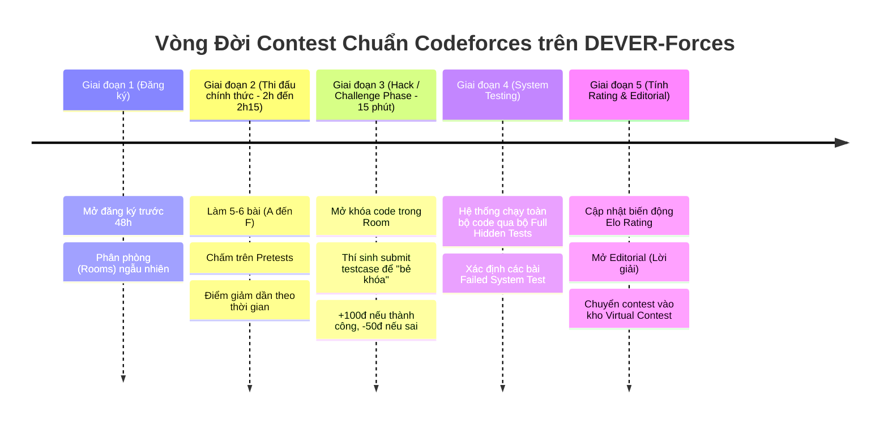

# 🏆 DEVER-FORCES — NỀN TẢNG THI ĐẤU GIẢI THUẬT NỘI BỘ CLB DEVER
> **Hệ thống tổ chức kỳ thi lập trình thi đấu (Competitive Programming) chuẩn Codeforces dành riêng cho sinh viên & thành viên CLB FU-DEVER.**

---

## MỤC LỤC
1. [Tầm Nhìn & Mục Tiêu Cốt Lõi](#1-tầm-nhìn--mục-tiêu-cốt-lõi)
2. [Vòng Đời Một Kỳ Thi Chuẩn Codeforces (Contest Lifecycle)](#2-vòng-đời-một-kỳ-thi-chuẩn-codeforces-contest-lifecycle)
3. [Cơ Chế Tính Điểm, Hack/Challenge & Phân Hạng](#3-cơ-chế-tính-điểm-hackchallenge--phân-hạng)
4. [Thiết Kế Giao Diện & Trải Nghiệm Người Dùng (UI/UX)](#4-thiết-kế-giao-diện--trải-nghiệm-người-dùng-uiux)
5. [Bộ Quy Chế Thi Đấu & Chống Gian Lận (Official Rulebook)](#5-bộ-quy-chế-thi-đấu--chống-gian-lận-official-rulebook)
6. [Quy Trình Soạn Đề & Chuẩn Bị Contest (Editorial & Problemsetter Workflow)](#6-quy-trình-soạn-đề--chuẩn-bị-contest-editorial--problemsetter-workflow)
7. [Kiến Trúc Kỹ Thuật Hệ Thống Chấm (Judge & Scalability Architecture)](#7-kiến-trúc-kỹ-thuật-hệ-thống-chấm-judge--scalability-architecture)

---

## 1. TẦM NHÌN & MỤC TIÊU CỐT LÕI

* **Tên nền tảng đề xuất:** **DEVER-Forces** *(hoặc DEVER Arena - Codeforces Engine)*.
* **Mục tiêu duy nhất & tối thượng:** Trở thành nền tảng thi đấu giải thuật độc lập, tự chủ hoàn toàn của CLB FU-DEVER, tổ chức các contest định kỳ theo đúng phong cách **Codeforces**:
  1. Thi đấu cá nhân tính điểm Elo Rating thời gian thực.
  2. Có vòng **Pretest**, giai đoạn **Challenge/Hack** và chấm lại toàn bộ bằng **System Test**.
  3. Phục vụ luyện thi ICPC, Olympic Tin học, tuyển quân cho CLB và đào tạo thế hệ thuật toán kế cận của FPTU.

---

## 2. VÒNG ĐỜI MỘT KỲ THI CHUẨN CODEFORCES (CONTEST LIFECYCLE)

Một kỳ thi chuẩn trên DEVER-Forces diễn ra qua 5 giai đoạn nghiêm ngặt:



### Chi tiết từng giai đoạn:
1. **Trước Contest (Registration & Room Assignment):**
   - Thí sinh bấm "Register". Hệ thống gom các thí sinh vào từng **Room** (mỗi phòng 20–30 người có mức rank tương đương) để chuẩn bị cho màn Hack nhau sau này.
2. **Trong Contest (Coding Phase - 120 phút):**
   - Đề mở từ bài dễ đến khó: Bài A (Newbie) ➔ Bài B (Cơ bản) ➔ Bài C (Tư duy) ➔ Bài D (Cấu trúc dữ liệu) ➔ Bài E/F (Hardcore).
   - Khi nộp bài, hệ thống **chỉ chấm trên bộ Pretest** (tập testcase mẫu và một vài test cơ bản).
   - Nếu qua hết Pretest: Thí sinh nhận trạng thái `Pretests Passed` và được ghi nhận số điểm tạm thời.
3. **Giai đoạn Đấu Trí: Hack / Challenge Phase (15 phút sau khi hết giờ code):**
   - Điểm đặc sắc nhất của Codeforces: Thí sinh trong cùng một Room được quyền mở xem code của các đối thủ khác (những bài đã `Pretests Passed`).
   - Nếu phát hiện code đối thủ bị lỗi tràn số nguyên (`int` thay vì `long long`), chạy quá thời gian với mảng lùi, hoặc thiếu trường hợp đặc biệt $N=1$: Thí sinh tạo một bộ input (hoặc chạy generator) và bấm **"HACK"**.
   - Nếu hack đúng: Thí sinh được **+100 điểm**, bài của đối thủ chuyển thành **Hacked**.
   - Nếu hack sai (code đối thủ vẫn chạy đúng): Thí sinh bị phạt **-50 điểm** để tránh việc spam test mò mẫm.
4. **Giai đoạn Chốt Hạ: System Testing:**
   - Sau khi kết thúc Hack Phase, hệ thống tự động chạy tất cả các bài nộp còn sống qua bộ **Full Test Suite** (bao gồm cả các testcase các thí sinh vừa dùng để hack thành công).
   - Những bài nộp yếu sẽ bị loại ở giai đoạn này: Trạng thái chuyển thành `Failed on system test X`.
5. **Sau Contest (Rating Update & Upsolving):**
   - Tính toán biến động Rating (Delta: $+75$, $-30$,...).
   - Mở toàn bộ Testcase để thí sinh kiểm tra xem mình sai ở đâu.
   - Phát hành Editorial (lời giải chính thức) và đưa contest vào chế độ **Virtual Contest** (để ai chưa thi có thể thi lại với trải nghiệm y hệt).

---

## 3. CƠ CHẾ TÍNH ĐIỂM, HACK/CHALLENGE & PHÂN HẠNG

### 3.1. Công thức Giảm Điểm Theo Thời Gian (Dynamic Point Decay)
Mỗi bài có điểm tối đa ban đầu (ví dụ: Bài A = 500, Bài B = 1000, Bài C = 1500,...). Càng nộp muộn, điểm nhận được càng giảm theo công thức:

$$\text{Points} = \max\left(0.3 \times P_{\max}, \; P_{\max} \times \left(1 - \frac{t}{250}\right) - 50 \times W\right)$$

* Trong đó:
  * $P_{\max}$: Điểm tối đa ban đầu của bài toán.
  * $t$: Số phút trôi qua tính từ lúc contest bắt đầu.
  * $W$: Số lần nộp sai trên bộ Pretest trước khi nộp đúng.
  * $0.3 \times P_{\max}$: Điểm sàn tối thiểu thí sinh nhận được nếu giải được bài (không bị trừ hết sạch điểm).

### 3.2. Hệ Thống Danh Hiệu & Phân Cấp Rank (DEVER Rating Tiers)
Thang đo Elo chuẩn hóa theo Codeforces:

| Mức Rating | Tên Danh Hiệu | Màu Đại Diện | Phù hợp tham gia |
| :---: | :--- | :--- | :--- |
| **< 1200** | **Newbie** | Xám (`#808080`) | Div. 4, Div. 3 |
| **1200 - 1399** | **Pupil** | Xanh lá (`#008000`) | Div. 4, Div. 3 |
| **1400 - 1599** | **Specialist** | Xanh lơ (`#03A89E`) | Div. 3, Div. 2 |
| **1600 - 1899** | **Expert** | Xanh lam (`#0000FF`) | Div. 2 |
| **1900 - 2199** | **Candidate Master** | Tím (`#AA00AA`) | Div. 1, Div. 2 |
| **2200 - 2399** | **Master** | Cam (`#FF8C00`) | Div. 1 |
| **≥ 2400** | **Grandmaster DEVER** | Đỏ (`#FF0000`) | Div. 1 |

---

## 4. THIẾT KẾ GIAO DIỆN & TRẢI NGHIỆM NGƯỜI DÙNG (UI/UX)

Giao diện DEVER-Forces hướng tới sự chuyên nghiệp, tối ưu tốc độ đọc/viết code và bảng điểm kịch tính:

### 4.1. Trang Danh Sách Bài & Bảng Điểm (Contest Dashboard)
* Thanh đồng hồ đếm ngược lớn (Countdown Timer) với trạng thái: `Coding Phase`, `Challenge Phase`, `System Testing`.
* Bảng tóm tắt bài thi: Ký hiệu bài (A, B, C, D,...), Tên bài, Điểm hiện tại, Giới hạn (1.0s / 256MB), Số lượng người đã pass.
* Nút nộp bài nhanh: Hỗ trợ nộp bằng cách paste code hoặc kéo thả file (`solution.cpp`).

### 4.2. Giao Diện Bảng Xếp Hạng (Standings)
* Hiển thị danh sách thí sinh có màu tên ứng với Rank hiện tại.
* Mỗi bài của thí sinh có ô hiển thị:
  * Điểm số nhận được (màu xanh lá) + số lần nộp sai (ví dụ: `+2` nghĩa là AC sau 2 lần sai).
  * Điểm âm màu đỏ nếu nộp nhưng chưa qua (`-3`).
  * Chỉ số Hack: Hiển thị dạng `+1 / -0` (hack thành công 1 lần) hoặc màu nền đổi khi bài bị người khác hack.

### 4.3. Giao Diện Hack Room (Đặc Sản Codeforces)
* Khi vào Room của mình, thí sinh thấy danh sách 20 thành viên trong phòng.
* Bấm vào điểm của một thí sinh bất kỳ ➔ Mở modal xem source code của họ (chế độ chỉ đọc).
* Có nút **"HACK THIS SOLUTION"**: Mở hộp thoại để nhập Input bẫy hoặc paste file test.
* Nhấn submit hack: Hệ thống chạy test trên máy chấm ngay trong 5-10s và trả về kết quả `Successful Hack` (+100 pts) hoặc `Unsuccessful Hack` (-50 pts).

---

## 5. BỘ QUY CHẾ THI ĐẤU & CHỐNG GIAN LẬN (OFFICIAL RULEBOOK)

### 5.1. Quy Chế Tham Gia
1. Thí sinh thi đấu với tư cách **cá nhân** (trừ các kỳ thi Team Contest có quy định riêng).
2. Nghiêm cấm chia sẻ ý tưởng, code, testcase dưới mọi hình thức (trực tiếp, tin nhắn Discord, Facebook, Telegram, GitHub bí mật) trong thời gian contest đang diễn ra.
3. Không được sử dụng nhiều tài khoản trong cùng một contest (Clone account/Smurfing để hack điểm).

### 5.2. Quy Định Về Công Cụ & AI
1. **Trong kỳ thi xếp hạng (Rated Contest):** Cấm hoàn toàn việc sử dụng ChatGPT, GitHub Copilot, Claude hoặc bất kỳ trợ lý tạo code AI nào.
2. Thí sinh được phép tra cứu tài liệu chuẩn (cplusplus.com, cppreference.com, tài liệu cú pháp ngôn ngữ).
3. Thí sinh được phép chuẩn bị sẵn thư viện thuật toán cá nhân (Code Library / Cheatsheet) do chính mình viết từ trước.

### 5.3. Quy Trình Hậu Kiểm Gian Lận (Plagiarism Detection)
* **Chạy MOSS / AST Tokenizer:** Toàn bộ code sau contest được quét so khớp cây cú pháp trừu tượng. Các bài nộp có mức tương đồng cấu trúc trên $85\%$ (dù đổi tên biến, thay vòng lặp `for` thành `while`, thêm comment giả) sẽ bị tự động đánh dấu cờ đỏ.
* **Hình phạt:**
  * Lần 1: Hủy kết quả contest, trừ 200 điểm Elo danh dự, công khai biên bản vi phạm.
  * Lần 2: Cấm thi vĩnh viễn trên nền tảng DEVER-Forces.

---

## 6. QUY TRÌNH SOẠN ĐỀ & CHUẨN BỊ CONTEST (PROBLEMSETTER WORKFLOW)

Để một Round diễn ra suôn sẻ, CLB áp dụng quy trình chuẩn **Polygon / Testlib**:

```
Ban Tổ Chức Round
├── Problemsetter (Tác giả ra đề)
│   ├── Viết đề bài (Markdown + LaTeX)
│   ├── Viết solution chuẩn (solution.cpp)
│   ├── Viết bộ sinh test (generator.cpp) bằng testlib.h
│   └── Viết bộ kiểm tra test hợp lệ (validator.cpp)
├── Coordinator (Trưởng ban chuyên môn)
│   └── Review tính sư phạm, sắp xếp thứ tự độ khó từ A đến E
└── Testers (2 - 3 coder cứng của CLB)
    ├── Giải đề độc lập trong điều kiện bí mật (Blind Test)
    ├── Viết giải thuật ngây thơ (Brute-force) để đối soát
    └── Cố tình viết các code sai thường gặp để xem Pretest có bắt được không
```

---

## 7. KIẾN TRÚC KỸ THUẬT HỆ THỐNG CHẤM (JUDGE ARCHITECTURE)

Hệ thống cần chịu tải khi hàng trăm sinh viên nộp bài đồng thời:

1. **Frontend:** React / Next.js hoặc Svelte (ưu tiên tốc độ tải cực nhanh), Monaco Editor, KaTeX render công thức toán học.
2. **Backend:** Go (Golang) hoặc Rust / Node.js gRPC server để điều phối hàng đợi chấm và WebSocket real-time bảng điểm.
3. **Judge Sandbox (Máy chấm):**
   * Sử dụng **Isolate** (Linux Sandbox được sử dụng tại ICPC World Finals và IOI) để cô lập môi trường thực thi, giới hạn CPU time chính xác đến $1\text{ms}$ và bộ nhớ đến $1\text{KB}$.
   * Hạn chế tối đa các cuộc tấn công phá hoại: cấm gọi hàm hệ thống nguy hiểm (`fork()`, mở kết nối mạng, đọc file ngoài sandbox).
4. **Hàng đợi Chấm (Queue Worker):**
   * RabbitMQ / Redis Streams: Đẩy các bài nộp vào hàng đợi để các máy chấm (Worker Nodes) xử lý theo thứ tự ưu tiên (Pretest xử lý nhanh, System test chạy sau).

---

*Tài liệu được soạn thảo bởi Ban Kỹ thuật & Học thuật CLB FU-DEVER.*
